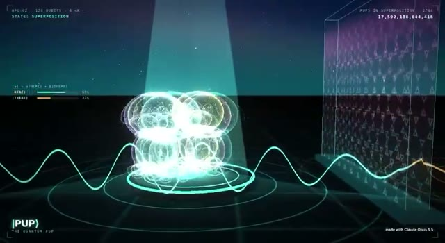

[← Back to gallery](../browse/education.en.md) · [简体中文](2108926559264379318.md)

# Pup’s Quantum Fetch Story

**[RGK · @rgk\_degen](https://x.com/rgk_degen)** · Education & explainers · 25s

> Discovery pool · Source verified; catalog details being completed.

**[▶ Open gallery to play](https://guanmo-ai.github.io/awesome-ai-motion/?lang=en#case-2108926559264379318)** · [Original post](https://x.com/rgk_degen/status/2108926559264379318)

Click the cover to open the gallery and play.

The creator credits Claude Opus 5.5 for an animation using a puppy, probability bars and a ball beyond a wall to dramatize quantum concepts. This is an anthropomorphic concept story; no verifiable quantum-computing implementation or complete prompt is provided.

Author brief · not the complete prompt. The complete instructions have not been verified; see the creator’s post. [View the original post](https://x.com/rgk_degen/status/2108926559264379318)

Bookmarks 2 · Likes 3 · Views 127

## Source record

- Original post: [@rgk\_degen](https://x.com/rgk_degen/status/2108926559264379318) · 2026-10-10T14:24:08+00:00
- Model attribution: Claude Opus 5.5 · [Creator’s statement](https://x.com/rgk_degen/status/2108926559264379318)
- Prompt source: [Creator post](https://x.com/rgk_degen/status/2108926559264379318) · 2026-10-10 15:00 UTC
- Cover source: [Original cover source](https://x.com/rgk_degen/status/2108926559264379318) · 8s
- Metrics snapshot: [Original X post](https://x.com/rgk_degen/status/2108926559264379318) · 2026-10-10 15:00 UTC
- Gallery video source: [Original post media record](https://x.com/rgk_degen/status/2108926559264379318) · 2026-10-10 15:00 UTC · Post/media correspondence and media response checked; external reference, no re-upload

Model attribution is based on creator statements. Prompts have not been independently rerun; sound and visuals have not received a uniform quality rating. Videos reference original post media, not our uploads; redistribution permission has not been verified.
